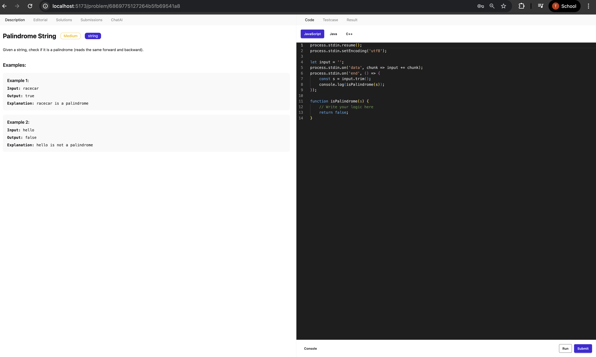
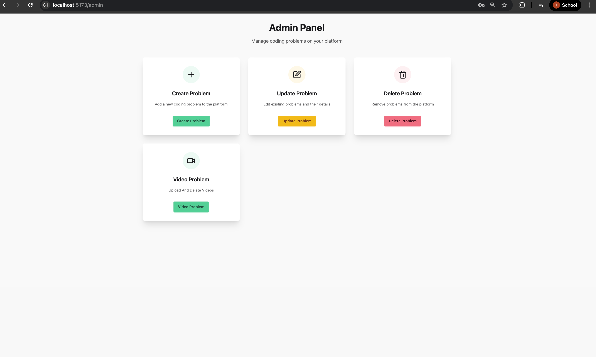

# CompileX 🚀
A modern coding platform for developers to practice algorithms, compete in challenges, and improve problem-solving skills.


---

## Table of Contents
1. [About](#about)
2. [Features](#features)
3. [Installation](#installation)
4. [Usage](#usage)
5. [Screenshots](#screenshots)
6. [Technologies Used](#technologies-used)

---

## About
CompileX is designed to help developers improve coding skills by providing:
- A wide range of algorithmic challenges.
- Real-time progress tracking.
- Tag-based problem filtering and difficulty levels.
- A collaborative and competitive environment.

---

## Features
- User authentication and profile management
- Dynamic problem filtering by tags and difficulty
- Track solved problems and challenges
- Leaderboard and community challenges
- Responsive design for web and mobile
- **Admin Panel** for managing:
  - Problems and test cases
  - Users and progress tracking
  - Leaderboards and analytics
  - Site settings and content moderation
 
---

## Installation
1. Clone the repository:
```bash
git clone https://github.com/tarun695/CompileX.git
cd CompileX
npm install
npm run dev - for both backend and frontend folders

``` 

---
## Usage

- **For Developers/Users:**
  - Sign up or log in to start solving coding challenges.
  - Browse problems by tags or difficulty.
  - Track your progress and view solved problems.

- **For Admins:**
  - Log in to the admin panel.
  - Manage coding problems, test cases, and difficulty levels.
  - Monitor user progress and manage leaderboards.

---

## Screenshots

**User Panel:**


**Admin Panel:**


---

## Technologies Used

**Frontend:**
- React
- Tailwind CSS
- React Router
- Redux
- Daisy UI

**Backend:**
- Node.js
- Express
- Redis (for caching and performance optimization)
- Rate Limiter (to prevent API abuse)

**Database:**
- MongoDB
- Mongoose

**Authentication & Security:**
- JWT (JSON Web Tokens)
- bcrypt for password hashing

**Media & Storage:**
- Cloudinary (for image/video hosting and management)


  


